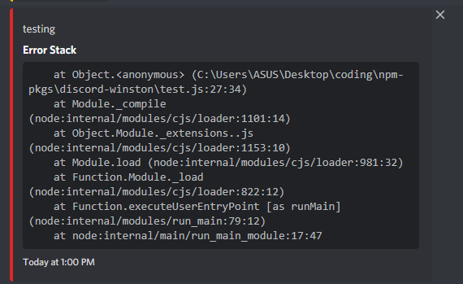

# @typicalninja21/discord-winston

> A transport for [Winston](https://www.npmjs.com/package/winston) which logs to a [Discord](https://discord.com) Channel using [Webhooks](https://support.discord.com/hc/en-us/articles/228383668-Intro-to-Webhooks)

# Install

`npm i @typicalninja21/discord-winston`

# Options accepted

> These are the options taken by the package

* options marked with [*] are required

**id** :- The id of the webhook *

**token** :- The token of the webhook *

**colors** :- The color to be used for embed for each log level [See the default values]

**postBody** :- Modify the body of the request, this is merged (using object.assign) with the internally created body, good for including custom properties in the body

### Default values

**colors**: 

```
    {
    error: 14362664,      // #db2828
    warn: 16497928,     // #fbbd08
    info: 2196944,   // #2185d0
    verbose: 6559689,// #6435c9
    debug: 2196944,  // #2185d0
    silly: 2210373    // #21ba45
    }
```

**postBody**: 

```
{}
```


# Usage

> here are some examples and images

### Base code
> as usual make sure to, make the transport and require winston (and your other modules) and create the logger

```js
const winston = require('winston');
const discordTransport = require('@typicalninja21/discord-winston');

const logger = winston.createLogger({
'transports': [
        new winston.transports.File({
            filename: `logs/new.log`,
        }),
        new winston.transports.Console(),
        new discordTransport({
            id: '78948458726857225', // example id
            token: 'dBwb4zNZGGUBgSkaqqWOHULVc_st6LJTvjLgvCIc__A7bW2jwMfunh8R6zR5dllao', // example token
          }),
    ],
    // ... rest of your code
});
```

> **For all of the below examples, logger is what that is defined above**


## Basic logging

```js
logger.warn('testing')
logger.error('testing')
logger.info('hey')
```


> Image 


## Log with Error stack trace

```js
logger.error('A Error occurred', { error: new Error() })
```

> Image





> `error` value can be replaced with a error variable from a `try-catch` or a `catch`


## Do not log to discord

```js
logger.error(`A Error occurred, ${err}`, {
    postToDiscord: false,
})
```